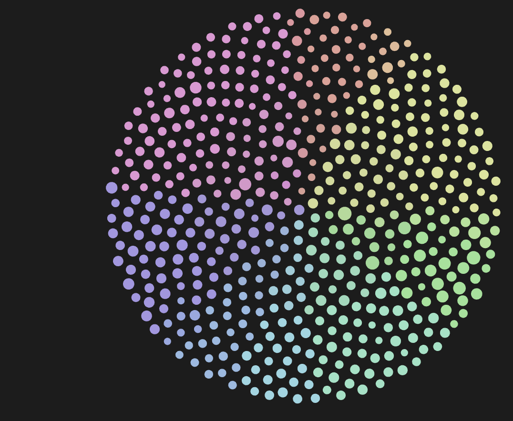

<h1 align="center">Graph Colour Spawn</h1>

<p align="center">
  <em>A living colour wheel for Obsidian. New notes join their neighbours.</em>
</p>

<p align="center">
  
  
  
</p>

---

<p align="center">
  
</p>

Notes start beside their colour group, larger groups get more room, and new
notes join their neighbours without resetting the whole layout.

Plain JavaScript. No build step, account, API key or external service.

## What it does

- Arranges notes in a filled disc, with neighbouring colours alongside each other.
- Spaces the palette according to the number of notes in each path group.
- Adds new notes near the group's current position, including after dragging.
- Lets Obsidian's native physics continue after the initial placement.
- Sizes nodes by link degree, with a maximum 2:1 ratio between rendered radii.
- Extends the native repel slider to 40 and remembers its value.
- Adds **Graph Colour Spawn: Respawn colour wheel** to the command palette.

It works with the global and local graph views. It changes graph settings and
layout, but does not edit your notes or make network requests.

## Settings

All optional, and empty on a fresh install, so the plugin only recolours the
groups your graph already has.

| Setting | Does |
| --- | --- |
| Colour groups to add | Group queries to keep present, one per line, such as `path:"notes/"`. |
| Colour groups to remove | Exact group queries to delete from the graph, one per line. |
| Session folder | Notes linked from this folder get a reserved yellow-orange colour when no group claims them. Empty turns it off. |

Changes apply within 15 seconds, or run **Respawn colour wheel**. The plugin
replaces configured group colours with its palette, and a fresh installation
sets the initial graph scale to `0.03`.

## Install

Once it is listed, install **Graph Colour Spawn** from Community plugins in Obsidian's settings. Until then:

Clone the repository straight into your vault's plugin directory:

```sh
git clone https://github.com/tjqscott/obsidian-graph-colour-spawn.git <vault>/.obsidian/plugins/graph-colour-spawn
```

Or use the install ZIP:

1. Close Obsidian and keep a copy of your vault's `.obsidian/graph.json` if you
   want to restore your current colours later.
2. Extract `graph-colour-spawn-1.3.0.zip` into your vault's `.obsidian/plugins/`.
   The resulting folder must be `.obsidian/plugins/graph-colour-spawn/` and
   contain `main.js` and `manifest.json`.
3. Reopen Obsidian and enable **Graph Colour Spawn** in Community plugins.
4. Open the graph. Use **Respawn colour wheel** whenever you want a fresh layout.

You can also copy `main.js` and `manifest.json` from this repository into that
plugin folder. There is no stylesheet or compilation step.

Disabling the plugin stops its updates. It does not restore the graph settings
it saved. To restore those, close Obsidian before replacing `graph.json` with
your saved copy.

## Compatibility

The plugin uses Obsidian's private graph renderer and worker interfaces. An
Obsidian update can break layout hooks even when the plugin loads successfully.
The manifest retains the original minimum version (`1.0.0`) and mobile flag;
these are not claims of a tested compatibility matrix.

Path classification supports simple `path:"folder/"` and `path:/regex/` groups.
Other queries may use the colour already assigned by Obsidian, but their group
populations are not counted by the plugin's path parser. The global palette is
also applied to open local graph views.

## Development

Edit `main.js` directly. Obsidian provides the `obsidian` module at runtime.
The tests stub that module, so no dependency installation is needed.

With Node.js 24 or newer:

```sh
node --test tests/test-*.js
```

These tests cover colour classification, deterministic layouts, incremental
spawning and preservation of existing positions. They are not a substitute for
checking compatibility inside Obsidian. GitHub Actions runs them on pushes and
pull requests.

Create the install and source ZIPs using Python 3.9 or newer:

```sh
python3 scripts/package.py
```

The packager uses an explicit file list and writes to `dist/`. It excludes the
vault, plugin `data.json`, credentials, Git history and machine-specific files.

## Releases

Keep the versions in `manifest.json`, `package.json` and `versions.json` in sync.
Run the packager, then create a GitHub release with the exact version as its tag
(for example, `1.2.0`, without a `v` prefix). Attach `main.js`, `manifest.json`
and the install ZIP. This follows the
[Obsidian release format](https://github.com/obsidianmd/obsidian-sample-plugin#releasing-new-releases).

## Credits and licence

Created by Taylor Scott. Derived from
[Graph Spawn](https://github.com/tjqscott/obsidian-graph-spawn), also by Taylor Scott.
The original MIT notice is preserved in `main.js` and [LICENSE](LICENSE).
